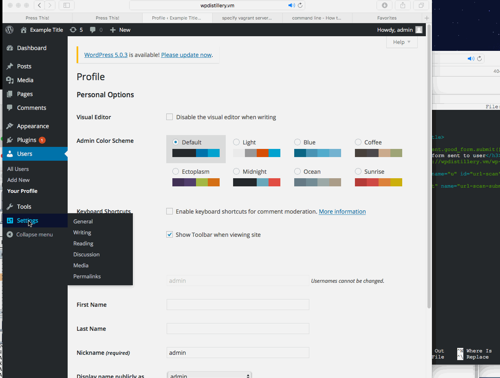

# Project 7 - WordPress Pentesting

Time spent: **X** hours spent in total

> Objective: Find, analyze, recreate, and document **five vulnerabilities** affecting an old version of WordPress

## Pentesting Report

1. (Required) Vulnerability: Unauthenticated Stored Cross-Site Scripting (XSS) ID: 7945
  - [ ] Summary: 4.2 version of Wordpress is vulnerable to a stored XSS attack. An unauthenticated attacker can inject JavaScript code in the Wordpress comments and JS code is executed when comment is viewed by anyone.
    - Vulnerability types: Stored XSS
    - Tested in version: 4.2
    - Fixed in version: 4.2.1
  - [ ] GIF Walkthrough: 
  - [ ] Steps to recreate:
	* Navigate to comment section of Wordpress website.
	* Fill out the Name and Email fields.
	* In the comment field, you should inject JS code similar to this:
``` <a title='x onmouseover=alert(unescape(/hello%20sher/.source)) style=position:absolute;left:0;top:0;width:5000px;height:5000px  AAAAAAAAAAAA...[64 kb]..AAA'></a>```
	* Make sure your comment length is greater than 64KB so we get SQL truncate our comment and store it in the database.The comment should be greater than 65635(64KB) characters. 
	* View the comments as an admin or a different user and you'll get an alert box. 

  - [ ] Affected source code:
    - [Link 1](https://core.trac.wordpress.org/changeset?sfp_email=&sfph_mail=&reponame=&new=32311%40branches%2F4.2&old=32300%40branches%2F4.2)

1. (Required) Vulnerability Name or ID: Server-side Request Forgery (id: 8376)
  - [ ] Summary: Press This feature in Wordpress allows internal GET Server Side Request Forgery via CSRF because it does not require csrf token for each request since the url does not validate if the user intends to send a scrape request. 
    - Vulnerability types: CSRF, SSRF
    - Tested in version: 4.2
    - Fixed in version: 4.2.7
  - [ ] GIF Walkthrough: 

  - [ ] Steps to recreate: 
  - [ ] Affected source code:
    - [Link 1](https://core.trac.wordpress.org/changeset?sfp_email=&sfph_mail=&reponame=&new=32311%40branches%2F4.2&old=32300%40branches%2F4.2)
1. (Required) Vulnerability Name or ID
  - [ ] Summary: 
    - Vulnerability types:
    - Tested in version:
    - Fixed in version: 
  - [ ] GIF Walkthrough: 
  - [ ] Steps to recreate: 
  - [ ] Affected source code:
    - [Link 1](https://core.trac.wordpress.org/browser/tags/version/src/source_file.php)
1. (Optional) Vulnerability Name or ID
  - [ ] Summary: 
    - Vulnerability types:
    - Tested in version:
    - Fixed in version: 
  - [ ] GIF Walkthrough: 
  - [ ] Steps to recreate: 
  - [ ] Affected source code:
    - [Link 1](https://core.trac.wordpress.org/browser/tags/version/src/source_file.php)
1. (Optional) Vulnerability Name or ID
  - [ ] Summary: 
    - Vulnerability types:
    - Tested in version:
    - Fixed in version: 
  - [ ] GIF Walkthrough: 
  - [ ] Steps to recreate: 
  - [ ] Affected source code:
    - [Link 1](https://core.trac.wordpress.org/browser/tags/version/src/source_file.php) 

## Assets

List any additional assets, such as scripts or files

## Resources

- [WordPress Source Browser](https://core.trac.wordpress.org/browser/)
- [WordPress Developer Reference](https://developer.wordpress.org/reference/)

GIFs created with [LiceCap](http://www.cockos.com/licecap/).

## Notes

Describe any challenges encountered while doing the work

## License

    Copyright [yyyy] [name of copyright owner]

    Licensed under the Apache License, Version 2.0 (the "License");
    you may not use this file except in compliance with the License.
    You may obtain a copy of the License at

        http://www.apache.org/licenses/LICENSE-2.0

    Unless required by applicable law or agreed to in writing, software
    distributed under the License is distributed on an "AS IS" BASIS,
    WITHOUT WARRANTIES OR CONDITIONS OF ANY KIND, either express or implied.
    See the License for the specific language governing permissions and
    limitations under the License.
