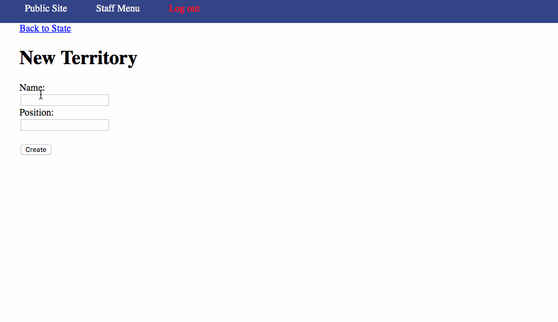
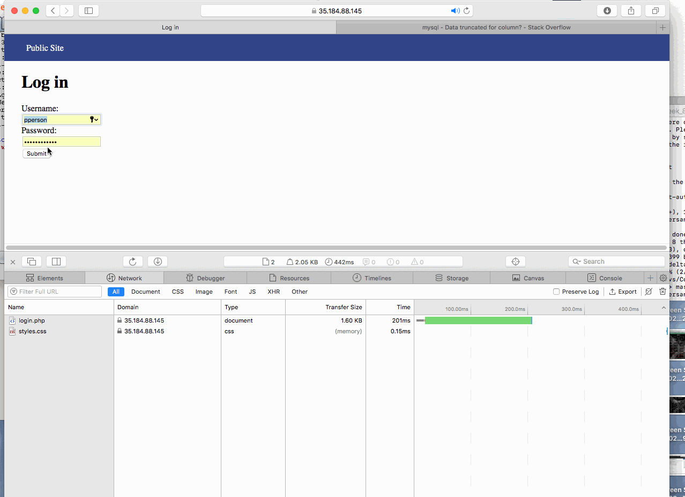
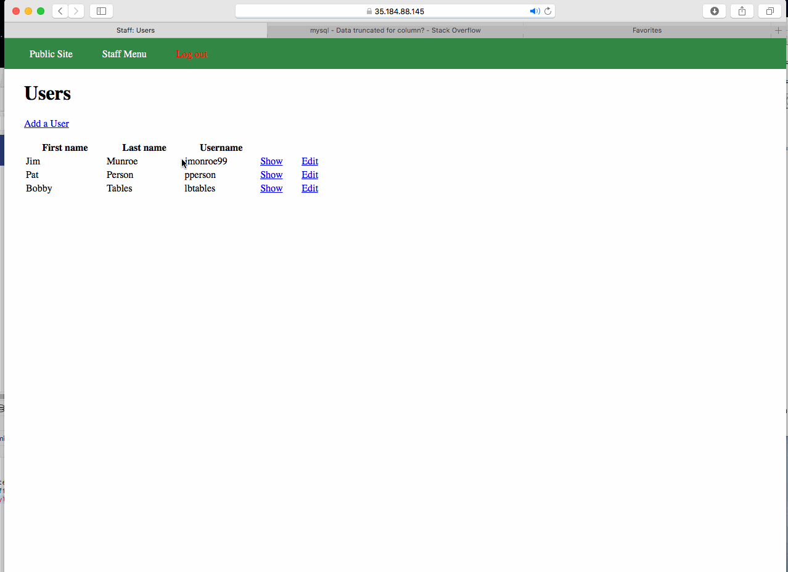
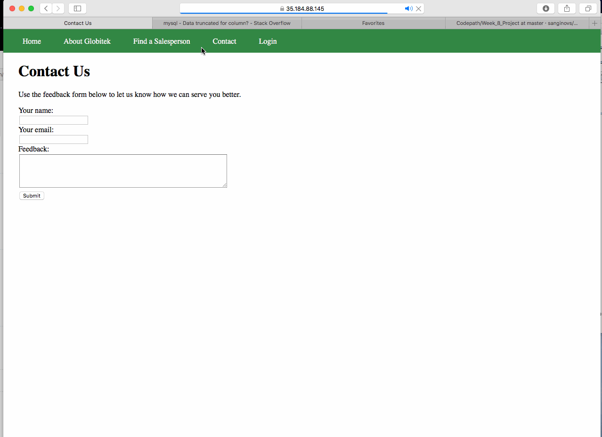
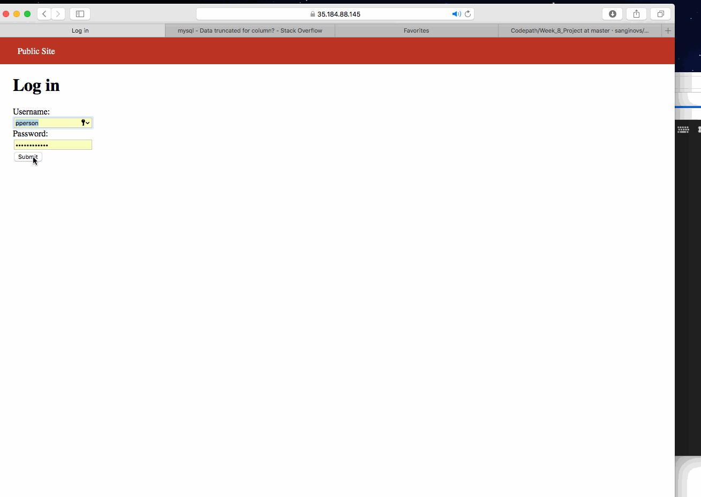
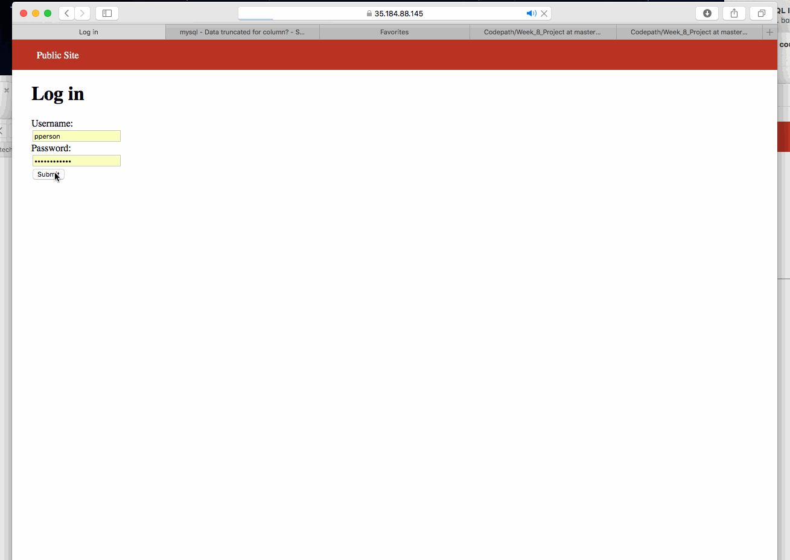

# Project 8 - Pentesting Live Targets

Time spent: **8** hours spent in total

> Objective: Identify vulnerabilities in three different versions of the Globitek website: blue, green, and red.

The six possible exploits are:
* Username Enumeration
* Insecure Direct Object Reference (IDOR)
* SQL Injection (SQLi)
* Cross-Site Scripting (XSS)
* Cross-Site Request Forgery (CSRF)
* Session Hijacking/Fixation

Each version of the site has been given two of the six vulnerabilities. (In other words, all six of the exploits should be assignable to one of the sites.)

## Blue

Vulnerability #1: SQL Injection

a. When adding a new territory, the form has two inputs: Name and Position. Position is vulnerable to SQL Injection. I was able to close the query with single quote and SQL server threw an error: Incorrect Integer value for column position at row 1.
b. When adding a new country, the form has three inputs: Name, Code, CountryId. CountryId is vulnerable to SQL Injection. I just used a single quote to figure it out. It threw an error : "Incorrect Integer value for column country_id at row 1",  "Data truncated for column country_id at row 1"

Vulnerability #2: Session Hijacking

a. I logged in Blue using Safari browser with my "pperson" user credentials. Then, I opened Firefox and navigated to Blue's index page. However, it redirected me to a login page. I copied the session id from Safari Browser and changed Firefox session id to it. Then, I was able to access the home page without logging using different browser and session id of the logged in user.

## Green

Vulnerability #1: Username Enumeration

Green is vulnerable to username enumeration. When a registered user type in their username but the wrong password, it shows an error message in **bold** saying **Log in was unsuccessful**. However, when an unregistered user puts in their wrong username and password, it shows the same error message not in bold: "Log in was unsuccessful." As a result, users who exist in the database are shown **"Log in was unsuccessful"** in bold.

Vulnerability #2: Cross-Site Scripting (XSS)

Green is also vulnerable to stored Cross-site scripting attack. There is a "Contact Us" form in the public section of the website. The feedback field in the Contact Us form is vulnerable to stored XSS. I was able to pass in JS code . However, once I logged into the website and navigated to Feedback section, the alert box popped up with a message "Hello Sher".

## Red

Vulnerability #1: CSRF

Vulnerability #2: IDOR

## Notes

Describe any challenges encountered while doing the work
